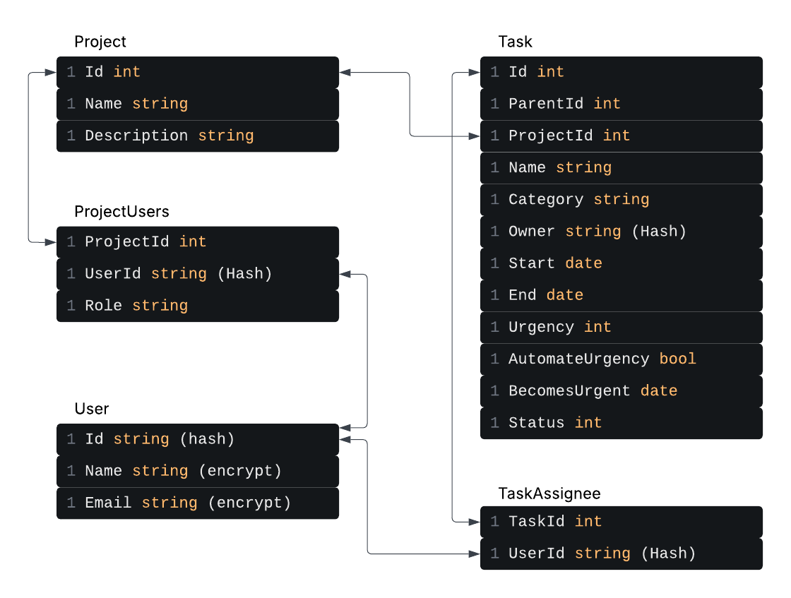

# Planner API
*Last Updated: 5-12-25*

This is a C# API built for use with the [React Planner Application](https://github.com/Jcfleming88/Planner_React). 

## Data Structure

Below is the current data structure for the planner. The base of the data structure is the Projects, Tasks and Users, with separate tables for ProjectUsers and TaskAssingees that will allow us to retrieve lists of the users assigned to projects and tasks.

## Authentication

Authentication will be handled through [Auth0](https://auth0.com/) to secure the calls and protect data.

## Encryption

User data such as the names and e-mails of people will be stored locally to simplify getting lists when assigning people to projects and tasks. To keep this information safe, names and emails will use symmetric encryption when storing it in the database and the user Id will be hashed as a precaution in case 3rd party ID's could be used for something else.

## Packages

*[OpenAPI](https://learn.microsoft.com/en-us/aspnet/core/fundamentals/openapi/aspnetcore-openapi?view=aspnetcore-10.0&tabs=visual-studio%2Cvisual-studio-code)* - For creating API docs
*[Scalar](https://scalar.com/)* - For making the docs readable!
